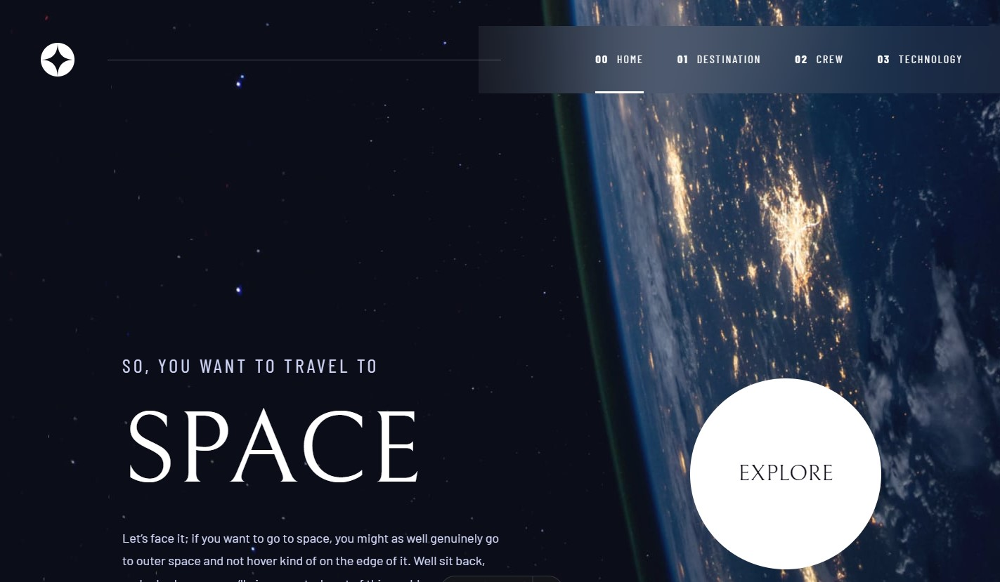

# Frontend Mentor - Space tourism website solution

This is a solution to the [Space tourism website challenge on Frontend Mentor](https://www.frontendmentor.io/challenges/space-tourism-multipage-website-gRWj1URZ3).

Run `npm istall` then `npm run dev` to run.

## Table of contents

- [Overview](#overview)
  - [The challenge](#the-challenge)
  - [Screenshot](#screenshot)
  - [Links](#links)
- [My process](#my-process)
  - [Built with](#built-with)
- [Author](#author)

## Overview

### The challenge

Users should be able to:

- View the optimal layout for each of the website's pages depending on their device's screen size
- See hover states for all interactive elements on the page
- View each page and be able to toggle between the tabs to see new information

### Screenshot

### Links

- Solution URL: [Github Repo](https://github.com/sophia-banou/space-tourism)
- Live Site URL: [Github Pages](https://sophia-banou.github.io/space-tourism/)

## My process

### Built with

- Astro
- HTML
- CSS
- JQuery

## Author

- Frontend Mentor - [sophia-banou](https://www.frontendmentor.io/profile/sophia-banou)
